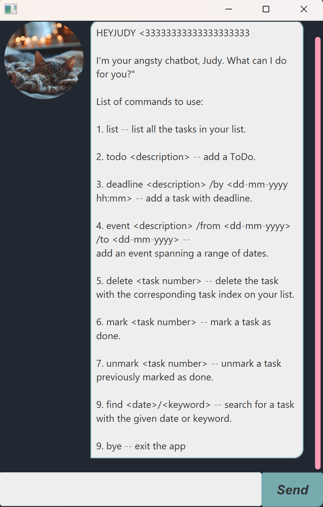

# HeyJudy User Guide

Welcome to HeyJudy chatbot! This is a chatbot that manages your tasks so that you don't have to. The interactions with the chatbot mainly uses Command Cine Interface (CLI), so there is a prerequisite for you to type fast and enjoy typing

Here are some features which you can explore.

**Table of content:**
- [Adding deadlines](#adding-deadlines)
- [Adding todos](#adding-todos)
- [Adding events](#adding-events)
- [Adding recurring tasks](#adding-recurring-tasks)
- [Delete a task](#delete-a-task)
- [List command](#list-command)
- [Marking a task as done](#marking-a-task as done)
- [Unmark a task](#unmark-a-task)
- [Find a task](#find-a-task)
- [Exit the app](#exit-the-app)

## Adding deadlines

Adds a task with deadline to the list of tasks you need to do.

Format: `deadline <description> /by <due date>`

Example: `deadline assignment 1 /by 2025-01-01 23:59`

> [!TIP]
> For dates, do input them in the right format without spaces in between!

## Adding todos

Adds a task you need to do.

Format: `todo <description>`

Example: `todo laundry`

## Adding events

Adds an event that ranges from a period of time.

Format: `event <description> /from <start date> /to <end date>`

Example: `event travelling /start 2025-01-01 /to 2025-01-10`

## Adding recurring tasks

Adds a task that is recurring daily, weekly, or monthly.

Format: `recurring <description> /at <date of first occurrence> /freq <frequency>`

Example: `recurring project meeting /at 2025-01-01 10:00 /freq weekly`

## Delete a task

Deletes a task in the list with the given task id.

Format: `delete <task id>`

Example: `delete 1`

> [!CAUTION]
> Action is irreversible, so do look up the correct task index by using the `list` command.

## List command

Lists all the tasks in the list, currently

Format: `list`

Example: 

## Marking a task as done

Marks a task at the given index of the list as done.

Format: `mark <task id>`

Example: `mark 2`

## Unmark a task

Marks a task at the given index of the list as undone.

Format: `unmark <task id>`

Example: `unmark 2`

> [!Note]
> For `mark` and `unmark`, marking/unmarking a done/undone task respectively does not change the status of the task.

## Find a task

Finds a task either by date or keyword.

Format: `find <keyword>/<date>`

Example: `find dri`

Example: `find 2025-02-25`

## Exit the app

Exits the application. Either by pressing the cross on the upper right hand corner of the main window or by passing in `bye`.